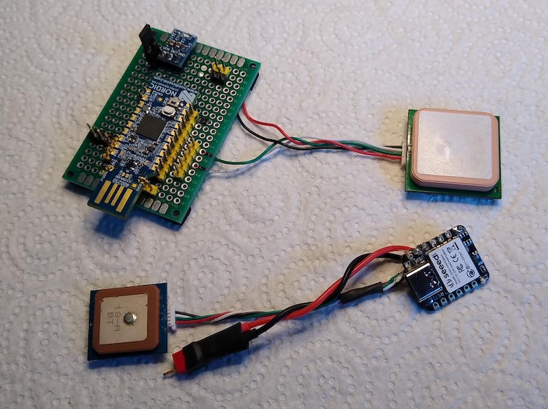

# Remote ID

A program for the nRF52840 that transmits opendroneid / ASTM F3411 / ASD-STAN 4709-002 UAV direct remote identification (DRI) signals over Bluetooth 4 and 5.

This was my first significant program using Zephyr. It may be my last :-).

Unlikely to see any further development. I've come to the conclusion that it is easier to use WiFi beacon for DRI. If I could find a reasonably priced Android tablet that is good at receiving Bluetooth 5 coded, I might change my mind.

## Getting Started

This program uses the nRF Connect SDK and Zephyr.

  * Install [nRF Connect for Desktop](https://www.nordicsemi.com/Products/Development-tools/nrf-connect-for-desktop) and use it to install the Programmer and the Toolchain Manager, then use the Toolchain Manager to install a toolchain. I have version 2.2 of the toolchain.
  * Get the blink app working.
  * Clone this repository.
  * Add copies of opendroneid.c and opendroneid.h from [opendroneid](https://github.com/opendroneid/opendroneid-core-c/tree/master/libopendroneid) to the src directory.
  * I set the board in the CMakeLists.txt file because I build using a batch file. You may need to comment this out.
  * Build and install.

## Hardware

### Boards

I have run this on the [nRF52840 dongle](https://www.nordicsemi.com/Products/Development-hardware/nrf52840-dongle) and the [Seeed XIAO nRF52840](https://www.seeedstudio.com/Seeed-XIAO-BLE-nRF52840-p-5201.html).

  * nRF dongle, put it into bootloader and use the nRF Programmer.
  * XIAO, double click the reset and use the script. The script uses an Adafruit utility. You will have to edit the com port and directories.

### GPS

The GPS needs to be one that will output NMEA and Ublox and will respond to Ublox commands, e.g. a Beitian BN-220. If it is set to 9600 baud (i.e. all the ones that I have out of the packet) the program will configure it.

## Notes

An ID created using this program will not comply with any tamper resistance requirements and I don't know how you would get an official serial number.

There is an option to generate the [Japanese variation](https://www.mlit.go.jp/koku/content/001582250.pdf) on F3411 with a authorisation code.

The nRF52840 can be programmed to respond on two I2C addresses so I was going to add Spektrum telemetry sensor functionality to this program. Sadly, I can't get it to do this using SDK 2.2 (I can get it to work as an I2C slave using Arduino and the Adafruit libraries). There is a (pretty horrible) [example](https://devzone.nordicsemi.com/guides/nrf-connect-sdk-guides/b/peripherals/posts/twi-ic2-implementation-with-nrfx-twis-driver) for an earlier version of the SDK, but it won't compile with 2.2.

## Photos

